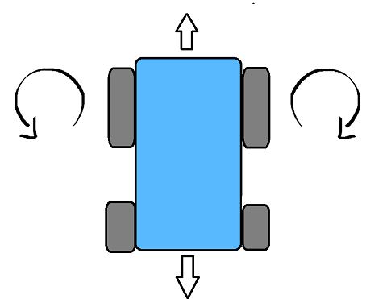

# Proyecto ICI4150-1- ROBOTICA Y SISTEMAS AUTONOMOS(1S2024)

## Integrantes

- Gerald Espinoza
- Lucas Robles

## Descripción

Este proyecto se realiza en conjunto con el proyecto del ramo **ICI4247-1- INGENIERIA WEB Y MOVIL(1S2024)** y fue seleccionada la propuesta de Proyecto 2: 

Se requiere un robot autónomo que pueda recorrer el siguiente laberinto, donde el robot pueda encontrar la salida. El camino debe tener en cuenta las limitaciones del vehículo para evitar colisiones. Al completar el laberinto, tu robot debería celebrar girando dos veces en el sentido de las agujas del reloj y luego dos giros en el sentido contrario a las agujas del reloj. La meta está marcada por el círculo rojo. Para aproximaciones de distancia, todos los bloques grises miden 50 cm * 10 cm.

##### Segunda Entrega Parcial

- EP2.1 Implementar la captura y almacenamiento de los datos de los sensores. (el almacenamiento de los datos puede ser JSON).
- EP2.2: Realizar diagramas de la propuesta, eso implica considerar aspectos como : (1) la comunicación con la UI, (2) si tiene asignado un robot móvil debe presentar mapa topgráfico. De lo contrario análisis de los movimientos (Cinemática) , (3) Interacció (guión), (4) arquitectura de control.
- EP2.3: Ubicación de los sensores y actuadores que se requieren en el robot seleccionado (hacer diagrama o tomar foto).

##### Primera Entrega Parcial

- EP1.1 ¿Qué tipo de robot es? (Justifique).
- EP1.2 ¿Qué tipo de sensores incluirá su robot?, ¿Cómo se puede extraer informació de los sensores? (Justifique, debe incluir al menos dos sensores).
- EP1.3 ¿Cómo podemos representar el error y cómo podemos razonar ante la incertidumbre?
- EP1.4 ¿Cómo se mueve el robot? (Puede existir un dibujo o gráfico)
- EP1.5 ¿Cuántos grados de libertad dispone el robot con el que va a trabajar? (Justifique)
- EP1.6 ¿Cómo se puede que controlar la velocidad de las ruedas para alcanzar una posició deseada?
- EP1.7 ¿Qué sistema embebido usará? (Arduino UNO, Raspberry Pi, Jetson Nano, etc) (Justifique).
- EP1.8 ¿Qué respuestas de retroalimentación tendrá el robot? (Justifique).

## Respuestas Segunda Entrega Parcial

### EP2.1 Implementar la captura y almacenamiento de los datos de los sensores. (el almacenamiento de los datos puede ser JSON).

La implementacion esta presente en la carpeta Codigo_Arduino_Python:

- Existe la carpeta "readDistance", que contiene el arduino que lee la distancia del sensor y la comunica al codigo python.
- BD.json guarda el json donde se guardan las distancias y las lecturas rgb.
- saveDistance recibe lo leido en arduino y lo guarda en el json con la estructura correcta.

Para esta implementacion, solo hicimos la captura y almacenamiento de datos del sensor Ultrasonido. Respecto al rgb, todos los guardara como si hubiera recibido rgb(100,30,20).

### EP2.2: Realizar diagramas de la propuesta, eso implica considerar aspectos como : (1) la comunicación con la UI, (2) si tiene asignado un robot móvil debe presentar mapa topgráfico. De lo contrario análisis de los movimientos (Cinemática) , (3) Interacció (guión), (4) arquitectura de control.

### EP2.3: Ubicación de los sensores y actuadores que se requieren en el robot seleccionado (hacer diagrama o tomar foto).

#### Todos los sensores y actuadores

#### Bluetooth

#### Ruedas

#### RGB

#### Servomotor

### EP1.4 ¿Cómo se mueve el robot? (Puede existir un dibujo o gráfico)

Solo se desplaza hacia adelante y hacia atrás, puede girar sobre sí mismo hasta 360 grados.

## Respuestas Primera Entrega Parcial

### EP1.1 ¿Qué tipo de robot es? (Justifique).

Se mueve por medio de ruedas debido a que es la forma más eficiente de recorrer el laberinto, por ende, es un robot clasificado como **móvil** respecto a su desplazamiento y estructura. Además de un robot de **servicio** según su aplicación debido a que es un robot de carácter personal, creado para entrenamiento y práctica de robótica.

### EP1.2 ¿Qué tipo de sensores incluirá su robot?, ¿Cómo se puede extraer informació de los sensores? (Justifique, debe incluir al menos dos sensores).

El robot incluye sensores de tipo inductivo, de proximidad, de posición y de distancia. Los sensores a usar en este robot son el sensor de **ultrasonido** y el sensor **infrarrojo**, estos 2 sensores pueden usarse como cualquiera de los 4 tipos antes mencionados y cada uno tiene su propia forma de conseguir información.

El sensor de **ultrasonido** medirá el tiempo entre la emisión de un pulso ultrasónico que realiza y la recepción del eco de dicho pulso y convertirá esa información en distancia entre un objeto directamente al frente del sensor y el sensor en sí.

El sensor **infrarrojo** emite una luz infrarroja que cuando golpea un objeto y esta se refleja de vuelta al sensor permite, según la intensidad y propiedades del material en el que se reflejó conocer la distancia del objeto respecto al sensor.

El robot recibe información de los sensores en forma de señales digitales, y procesa dicha información.

### EP1.3 ¿Cómo podemos representar el error y cómo podemos razonar ante la incertidumbre?

El error puede ser representado como el valor absoluto de: valor real restado al valor estimado. 

Por ejemplo, tenemos:
- Distancia real entre el robot y un objeto (DT: Distance True)  
- Distancia percibida por el robot (DP: Distance Percibe). 

- Con la formula $Error = DT - DP$

Para razonar ante la incertidumbre podemos establecer un margen de error en la lógica del robot para cada valor que pueda percibir, y que antes de tomar una decisión tome en cuenta dicho margen de error.

### EP1.4 ¿Cómo se mueve el robot? (Puede existir un dibujo o gráfico)

Solo se desplaza hacia adelante y hacia atrás, puede girar sobre sí mismo hasta 360 grados.

### EP1.5 ¿Cuántos grados de libertad dispone el robot con el que va a trabajar? (Justifique)

El robot posee $1$ **Servomotor** y $2$ **Ruedas Estándar**, por ello dispone de $5$ GL  (GL: grados de libertad)

- **Servomotor:** 1GL
- **Rueda Estándar:** 2GL

**Servomotor** $+$ **Rueda Estándar** $+$ **Rueda Estándar** $=$ **Robot**

$1$ GL $+$ $2$ GL $+$ $2$ GL $=$ $5$ GL

#### **Servomotor**
Tiene $1$ GL porque el servomotor puede rotar en torno a un eje específico. Se usara para rotar la cabeza del robot

#### **Rueda Estándar**
Tiene $2$ GL porque la rueda puede moverse en $2$ direcciones independientes. Puede moverce hacia adelante y hacia atras, ademas de ser capaz de girar alrededor de un eje perpendicular. Se usaran $2$ de estas ruedas para el movimiento del robot en el laberinto.

### EP1.6 ¿Cómo se puede que controlar la velocidad de las ruedas para alcanzar una posición deseada?

**Con el controlador PID:**

- El controlador PID (Proporcional-Integral-Derivativo) es una técnica de control ampliamente utilizada en robótica debido a su capacidad para ajustar dinámicamente las velocidades de las ruedas del robot en función de la diferencia entre su posición actual y la posición deseada.

- Este método funciona calculando continuamente un valor de error, que es la discrepancia entre la posición actual y la deseada del robot. Utilizando este error, el controlador PID genera una señal de control que ajusta las velocidades de las ruedas para minimizar este error y acercar al robot a su objetivo.

- El componente proporcional del controlador responde directamente al error actual, ajustando las velocidades de las ruedas en función de la magnitud del error. El componente integral considera la historia pasada de errores y ayuda a corregir los errores acumulados a lo largo del tiempo. El componente derivativo tiene en cuenta la tasa de cambio del error, lo que ayuda a prevenir oscilaciones excesivas y mejorar la estabilidad del sistema.

### EP1.7 ¿Qué sistema embebido usará? (Arduino UNO, Raspberry Pi, Jetson Nano, etc) (Justifique).

Usará Arduino UNO porque es un sencillo y fácil de usar, cumple con los requerimientos del robot mientras es más económico que otras opciones (Raspberry Pi) y posee robustez y estabilidad. Además el equipo de desarrollo está familiarizado con la programación y ejecución de Arduino UNO.

### EP1.8 ¿Qué respuestas de retroalimentación tendrá el robot? (Justifique).

El robot poseerá un sensor de infrarrojo que le permitirá detectar obstáculos cercanos, cuando se encuentre lo suficientemente cerca de los mismos. Cuando se encuentre en la distancia indicada el robot girará hacia unos de los lados buscando esquivar el obstáculo.

El robot complementariamente tendrá un sensor de ultrasonido que le permitirá calcular distancias más largas complementando a su vez el sensor de infrarrojos.