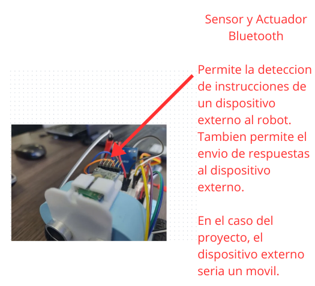

# Proyecto ICI4150-1- ROBOTICA Y SISTEMAS AUTONOMOS(1S2024)

## Integrantes

- Gerald Espinoza
- Lucas Robles

## Descripción

Este proyecto se realiza en conjunto con el proyecto del ramo **ICI4247-1- INGENIERIA WEB Y MOVIL(1S2024)** y fue seleccionada la propuesta de Proyecto 2: 

Se requiere un robot autónomo que pueda recorrer el siguiente laberinto, donde el robot pueda encontrar la salida. El camino debe tener en cuenta las limitaciones del vehículo para evitar colisiones. Al completar el laberinto, tu robot debería celebrar girando dos veces en el sentido de las agujas del reloj y luego dos giros en el sentido contrario a las agujas del reloj. La meta está marcada por el círculo rojo. Para aproximaciones de distancia, todos los bloques grises miden 50 cm * 10 cm.

##### Segunda Entrega Parcial

- EP2.1 Implementar la captura y almacenamiento de los datos de los sensores. (el almacenamiento de los datos puede ser JSON).
- EP2.2: Realizar diagramas de la propuesta, eso implica considerar aspectos como : (1) la comunicación con la UI, (2) si tiene asignado un robot móvil debe presentar mapa topgráfico. De lo contrario análisis de los movimientos (Cinemática) , (3) Interacció (guión), (4) arquitectura de control.
- EP2.3: Ubicación de los sensores y actuadores que se requieren en el robot seleccionado (hacer diagrama o tomar foto).

## Respuestas Segunda Entrega Parcial

### EP2.1 Implementar la captura y almacenamiento de los datos de los sensores. (el almacenamiento de los datos puede ser JSON).

La implementacion esta presente en la carpeta Codigo_Arduino_Python:

- Existe la carpeta "readDistance", que contiene el arduino que lee la distancia del sensor y la comunica al codigo python.
- BD.json guarda el json donde se guardan las distancias y las lecturas rgb.
- saveDistance recibe lo leido en arduino en el codigo python y lo guarda en el json con la estructura correcta.

Para esta implementacion, solo hicimos la captura y almacenamiento de datos del sensor Ultrasonido. Respecto al rgb, todos los guardara como si hubiera recibido rgb(100,30,20).

Para que funcione, asegurese de usar los pines puestos en el codigo arduino para trigger y echo, y en python use el mismo 'COMX' que en el arduino. Siendo X un numero entero mayor a uno.

Se debe ejecutar el codigo arduino antes que el codigo python.

El codigo tiene un bucle para que no este guardando datos infinitamente.

### EP2.2: Realizar diagramas de la propuesta, eso implica considerar aspectos como : (1) la comunicación con la UI, (2) si tiene asignado un robot móvil debe presentar mapa topgráfico. De lo contrario análisis de los movimientos (Cinemática) , (3) Interacció (guión), (4) arquitectura de control.

- (1) La comunicación con la UI

Diagrama de Componentes:

Diagrama de Secuencia:

- (2) Mapa topgráfico

El cuadrado verde es el robot, y el cuadrado rojo es la meta.

### EP2.3: Ubicación de los sensores y actuadores que se requieren en el robot seleccionado (hacer diagrama o tomar foto).

#### Todos los sensores y actuadores

#### Bluetooth

#### RGB

#### Ultrasonido

#### Ruedas

#### Servomotor

